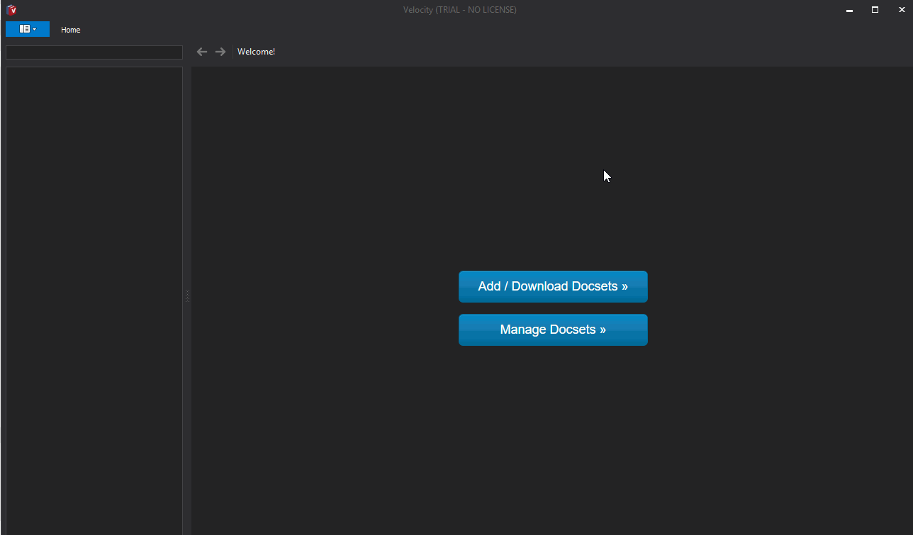
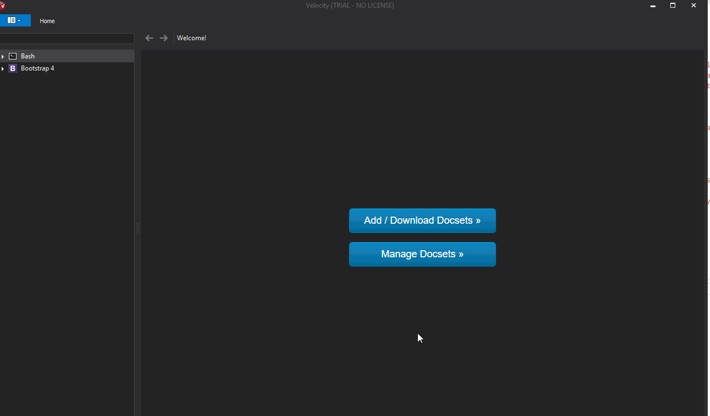

# **Velocity - Documentation Set Viewer** 

## Velocity is a documentation set Viewer. Docset(short for Documentation Set) is a written text that comes with a software that tells you how to use the software effectively. The Docset might contain guides, list of API reference and _**whatnot**_. As the software programmers and developers write source code, they would constantly refer to multiple Docsets. 

# **Experiments**

### **1.** With Velocity, you can download over 150 docsets. To install Velocity, download the Velocity software from the official website given in the reference section. Once installed, open Velocity from the start menu. You should see a window like you see below. 

### **2.** What Velocity does is that, it helps you view and keep all your docsets in one place. _**To put things into perspective**_, let's take Bash and Bootstrap 4 as examples. 

### You can find the docset of bash here: https://tiswww.case.edu/php/chet/bash/bashref.html.

### The docset for Bootstrap 4 here: https://getbootstrap.com/docs/4.1/getting-started/introduction/

### You don't have to use Velocity to view docsets. You can actually use the above links to read the documentation on your favorite browser. Velocity is very useful especially when working with docsets that are older and difficult to access information like Bash's docset above for example. It's recommended that you use Velocity to view docsets when it comes to some technologies. 

### **2.** To download a docset in Velocity, click the "Add/Download Docsets" button. You should see a list of all docsets available for you to download. For practice, I want you to download these docsets: Bash and Bootstrap 4. 

### **3.** Once you've downloaded the docset, you can view the docset from Velocity. I want you to see Bash docset from Velocity and compare it with the Bash docset link I've provided above. The below gif shows how Velocity _**compartmentalizes**_ the docset into different categories making it easy for you to find something right away. 

### Play around with Velocity to get a feel for it. 

### Look for the "cd" command inside the "builtins" category of Bash docset. Write the first sentence into "master.md"
### Look for the "BASH_VERSION" variable inside the "variables" category of Bash docset. Write the definition of the variable into "master.md".
### Look for the "HOSTNAME" variable inside the "variables" category of Bash docset. Write the definition of the variable into "master.md".

## **Reference**

### [Velocity]()

### **Source:** https://velocity.silverlakesoftware.com/
